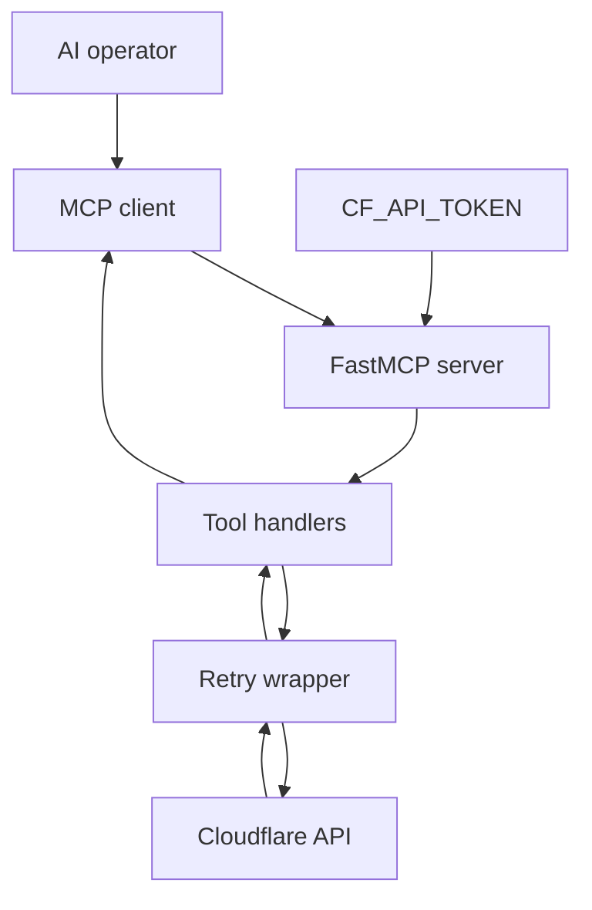
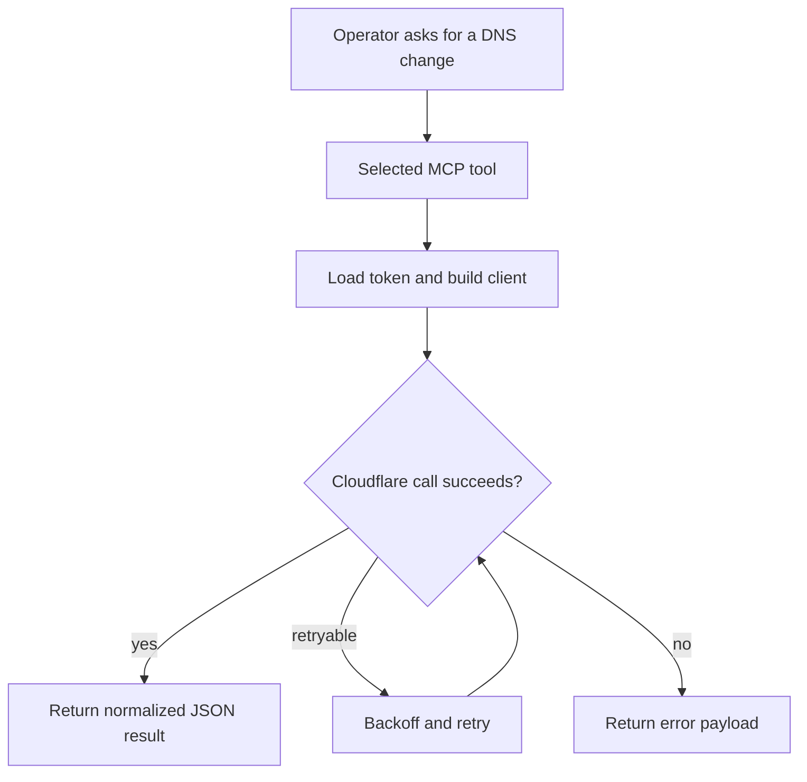

# mcp-cloudflare-dns

Cloudflare DNS MCP server for operators who need zone, record, cache, and page-rule control from
an MCP client without opening the Cloudflare dashboard for every change.

Release posture: beta package, version `0.1.1` from [`pyproject.toml`](pyproject.toml).

## Choose your path

| You are... | Start here | Then |
|---|---|---|
| Installing the server in Claude/Codex/Cursor | [docs/start-here.md](docs/start-here.md) | Quick start below |
| Verifying what the server can touch | [Available tools](#available-tools) | [docs/architecture.md](docs/architecture.md) |
| Auditing packaging or release metadata | [`pyproject.toml`](pyproject.toml) | [`server.json`](server.json) |

## Architecture



## Request flow



## Quick start

1. Install the package.

```bash
python -m pip install mcp-cloudflare-dns
```

2. Export a token with DNS permissions.

```bash
export CF_API_TOKEN="your-cloudflare-api-token"
```

3. Register it in your MCP client.

```json
{
  "mcpServers": {
    "cloudflare-dns": {
      "command": "uvx",
      "args": ["mcp-cloudflare-dns"],
      "env": {
        "CF_API_TOKEN": "your-cloudflare-api-token"
      }
    }
  }
}
```

## Available tools

| Tool group | Tools | Purpose |
|---|---|---|
| Zone inventory | `list_zones`, `get_zone`, `get_zone_settings` | Inspect available zones and key settings |
| DNS records | `list_dns_records`, `get_dns_record`, `create_dns_record`, `update_dns_record`, `delete_dns_record` | Read and mutate records |
| Edge actions | `purge_cache`, `list_page_rules` | Invalidate cached content and inspect page rules |

`delete_dns_record` and full-cache actions stay gated behind the destructive env flags described in
[docs/start-here.md](docs/start-here.md).

## Runtime proof

| Claim | Proof |
|---|---|
| Package entry point is stable | `mcp-cloudflare-dns = "cf.server:main"` in [`pyproject.toml`](pyproject.toml) |
| Server is MCP-specific, not a generic CLI | `FastMCP("mcp-cloudflare-dns")` in [`cf/server.py`](cf/server.py) |
| Cloudflare failures are retried | `_call()` in [`cf/server.py`](cf/server.py) |
| Release artifacts are built | `dist/` wheel and tarball are checked into the repo |

## Repo map

| Path | Purpose |
|---|---|
| [`cf/server.py`](cf/server.py) | FastMCP tool surface, env loading, retry wrapper |
| [`pyproject.toml`](pyproject.toml) | Package metadata, version, script entry point |
| [`server.json`](server.json) | Registry-facing metadata for MCP discovery |
| [`docs/start-here.md`](docs/start-here.md) | Setup, env, validation, common failures |
| [`docs/architecture.md`](docs/architecture.md) | Component map and request lifecycle |

## Validation

| Check | Command |
|---|---|
| Import compiles | `python -m compileall cf` |
| Package builds | `python -m build` |
| README links stay local | `rg '\\]\\(([^)]+\\.md)\\)' README.md docs/` |

## License

MIT

<!-- mcp-name: io.github.Ayo-Fam/mcp-cloudflare-dns -->


## Project context for new tasks

Read [prompt.md](prompt.md), then [INDEX.md](INDEX.md), for project-specific decisions, task routes and current handoff. Historical examples do not select the current task.
