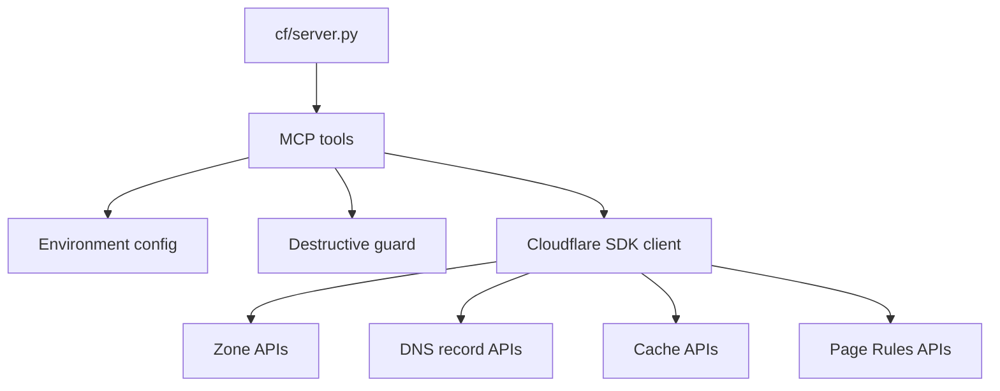
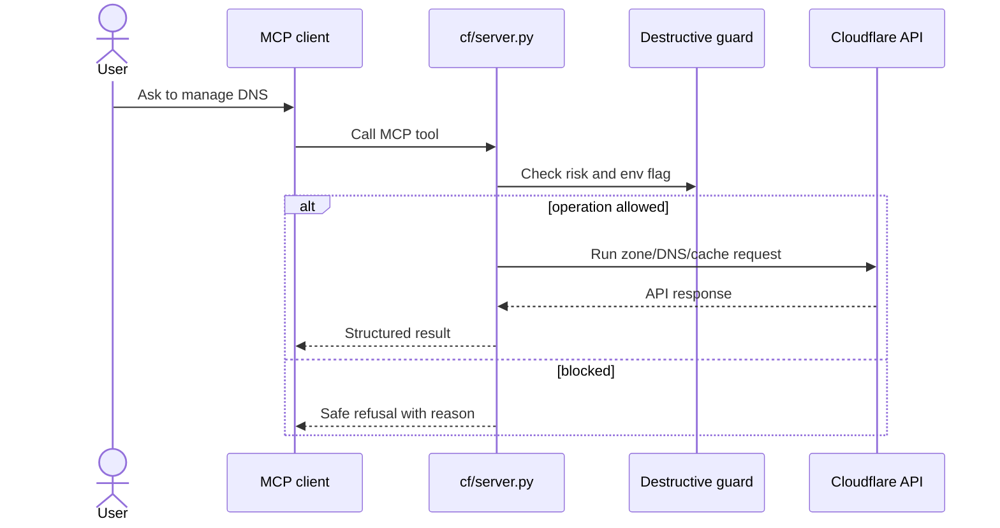

# Architecture

`mcp-cloudflare-dns` is a Python MCP server around Cloudflare zone administration. It keeps the
surface small: zones, records, cache purge, page rules, and settings.

## Components

## Request Sequence

## Data Boundaries

| Data | Source | Storage |
|---|---|---|
| Cloudflare API token | `CF_API_TOKEN` or `CLOUDFLARE_API_TOKEN` | Environment only. |
| Destructive mode | `CF_ALLOW_DESTRUCTIVE` | Environment only. |
| Zone/record data | Cloudflare API | Returned through MCP; not persisted here. |

## Extension Points

| Change | File |
|---|---|
| Add a new Cloudflare tool | `cf/server.py` |
| Change destructive safety rules | `cf/server.py` |
| Add package metadata | `pyproject.toml` |
